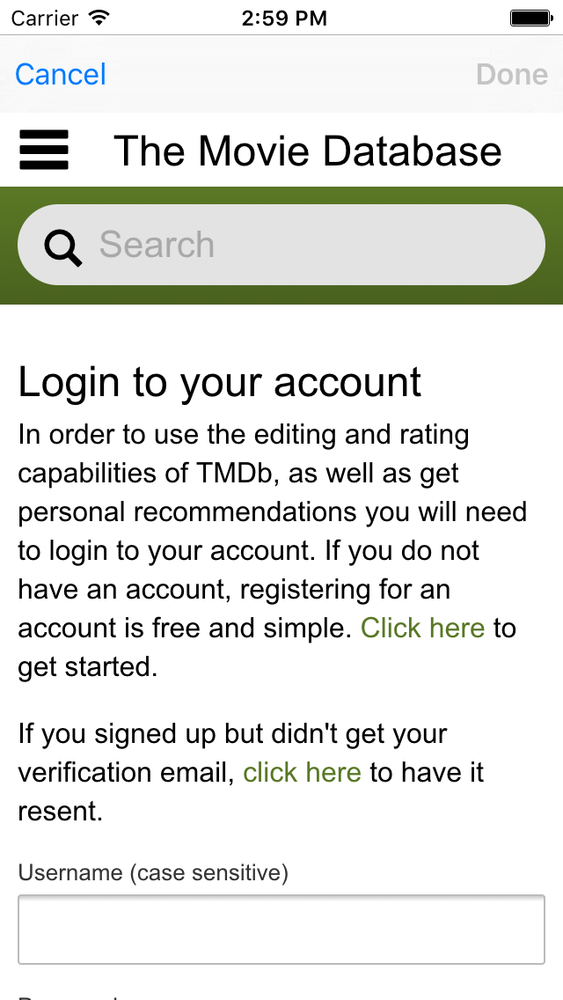
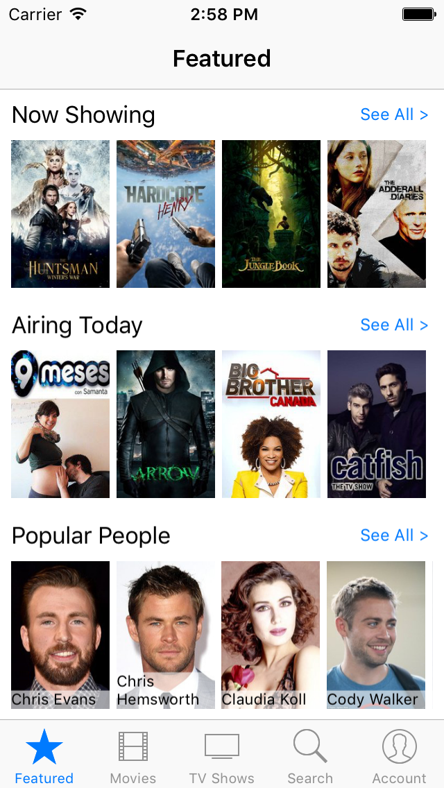
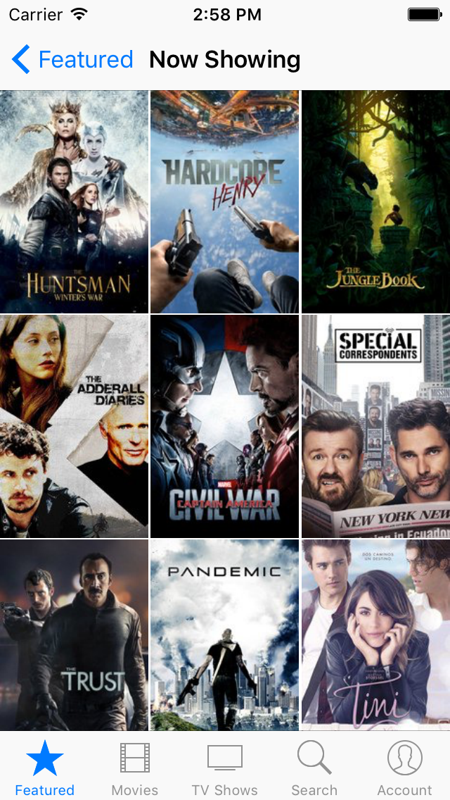
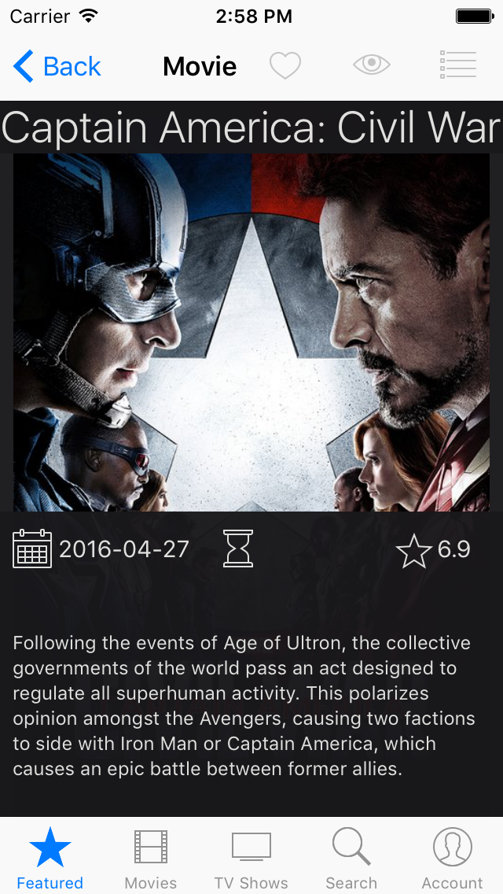
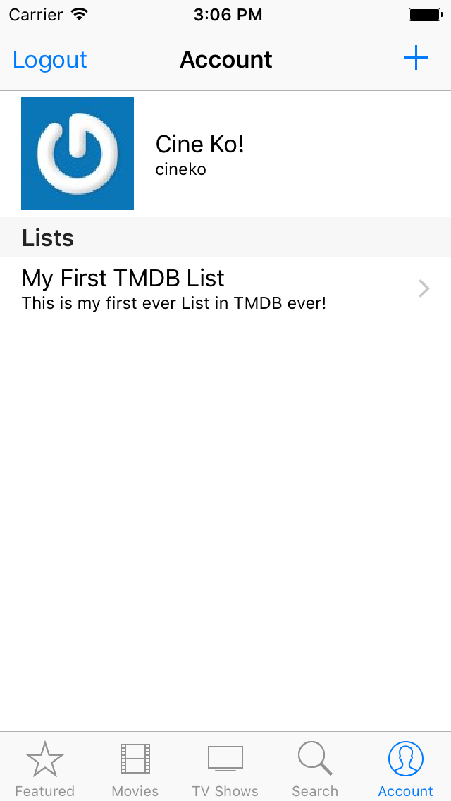

# Cine Ko!

Cine Ko! is an iOS app that connects to [themoviedb.org](https://www.themoviedb.org).

This is the author's Udacity capstone project for the iOS Developer Nanodegree program.

## Features

 * Movies (Now Showing, Popular, Top Rated, Coming Soon, Genres)
 * TV Shows (Airing Today, Popular, Top Rated, On the Air)
 * People (Popular)
 * Search Movies, TV Shows, and People
 * Account (Favorites, Watchlists, Lists)
 
## Compatibility
 
 * iPhone and iPad
 * Minimum iOS version: 9.0
 
## Cloning

Clone the GitHub repository and open the project workspace.

```
$ git clone https://github.com/jovito-royeca/Cineko.git
$ cd Cineko
$ open Cineko.xcworkspace
```

## TestFlight

If you want to participate in TestFlighting Cine Ko!, email your Apple ID below and I will add you to TestFlight External Testers

[jovit.royeca@gmail.com](mailto:jovit.royeca@gmail.com)
 
## Screenshots




<p/>




## License

Cine Ko! is licensed via [Apache License v2.0](LICENSE).

## Author
Jovito Royeca, http://jovitoroyeca.com
